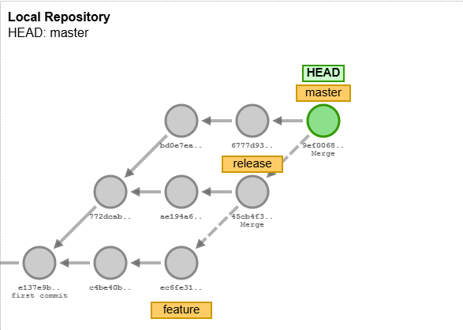

# Git branching

## Steps to create a branching repository



```bash
git branch feature
git checkout feature
git commit
git commit
git checkout master
git commit
git branch release
git checkout release
git commit
git merge feature
git checkout master
git commit
git commit
git merge release
```

## Rulesets


## Merging PR


